# Binary Bomb lab

**Description**
: Bomb lab is a Reverse Engineering challenge,to solve you have to reverse the bomb file and find 6 hidden flages (passwords).

### Before solvinig the lab

Before solving the lab yoou have first to know some information about the lab to get we use **" file bomb"**
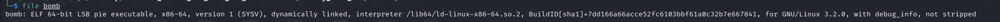
from that we knew 
1. The file is **x86-64 architecture** 
2. It's **dynamically linked** 
That means a pointer to the file being linked in (the file name of the file, for example) is included in the executable and the contents of said file are not included at link time. It's only when you later run the executable that these dynamically linked files are bought in and they're only bought into the in-memory copy of the executable, not the one on disk.
3. It's **not stripped** 
which means that functions' names are  not hidden

### Running

Here I used ***IDA*** as disassembler

After running our bomb in ***IDA*** and heading to the main we see this. 
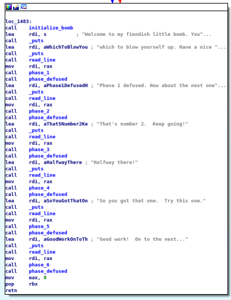

Aa a quick look we find that we have 6 phases to solve 
Here we intialise the bomb and after running it dynamically we will find a massage :
**"Welcome to my fiendish little bomb. You have 6 phases with
which to blow yourself up. Have a nice day!"**
Here the program stops expecting input (pass number one).
That takes us yo phase 1.

### Phase 1 

here he take the value we enter and store it in ***"RAX"*** then compare it with another string stored in ***"RSI"*** using **strings_not_equal** from the name we can easly figure out that it see if the 2 stings are the same or not so easly we ca check the value stored in ***"RSI"*** and we will fiind out our password 
**"I am just a renegade hockey mom."**

### Phase 2

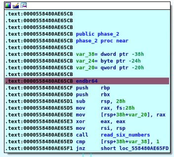

Here we take the input,creat our stack block and call **"read_six_numbers"**
which tace an input as 6 integers then compare the first one with **"1"** which means here that first number of our password is **"1"**

Then enter a loop or explode bomb **"jnz"**
if zero flag is set then continue if equal zero then explode bomb
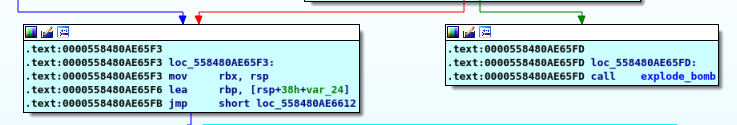

here we get into the loop
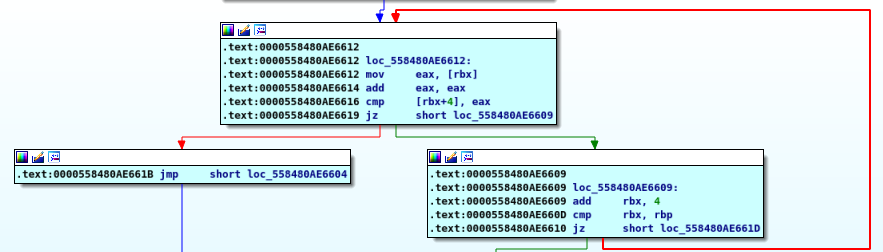

we move **"eax"** into **"rbx"** then add **"eax"** to itself
it's the same as mulipling it by X2
then compare it with the input 
so we find that the password is ***"1 2 4 8 16 32"***

### Phase 3

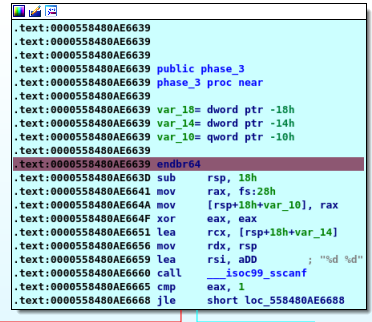

first thing to notice **" __iso99_sscanf "** which returnes numbebr of inputs 
here we have two inputs as **"%d"** which referes to integer
 
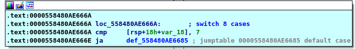

here is a switch case 
if the first is above 7 it will explode bomb else it will enter the switch using the first input 
here is the most complicated part,I will start with number 4 
so we will jumb to case 4
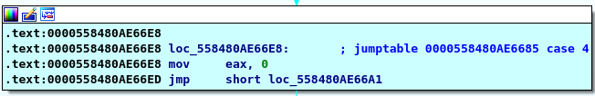
here we put zero into ***"eax"***
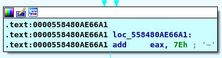
add 0x7E to 0 then we have 0x7E in our REG
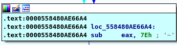
subtract 0x7E then we have 0 in our REG
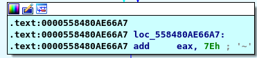
add 0x7E to 0 then we have 0x7E in our REG
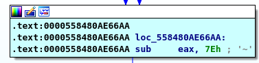
subtract 0x7E then we have 0 in our REG
so our final comparison
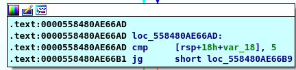
compare the first input with 5
so we have a new condition that the frist input must be less than or equal to 5 
for every number there is another case to second one 
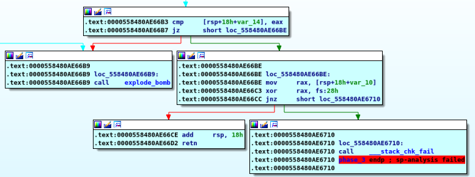
the second condition is that the second input must equal the value in eax 
in my case it's **"4 0"**  I will let you try the others

### Phase 4
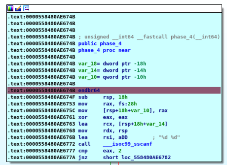

Here we find **scanf** again and we know again that we have two integers 

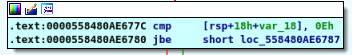
here he just cheks that first input is less than **14**

then we enter **fun4** taking 3 arguments (first inpute,0,14)

then there is some maths are done  
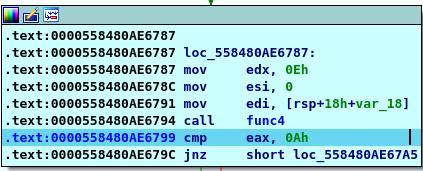
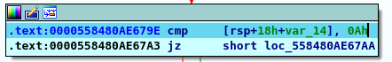

As a conclusion from those two conditions that the returne of the function must equal 10 and the second inpute must be 10 as will
so you know now that our password is **(number 10)**
now you have two options you can follow the maths or bruteforce it using any script 
the two wayes lead you to **"3 10"**

### Phase 5
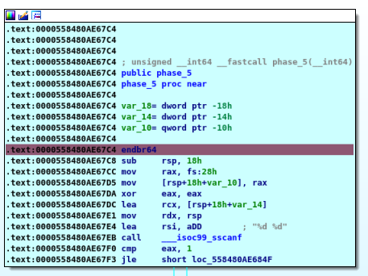

One more time with **scanf** and again two integers

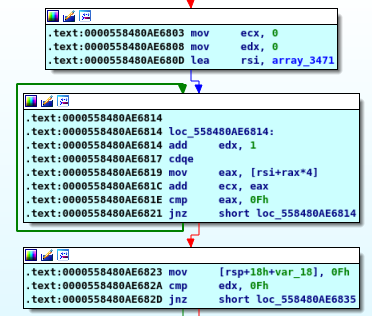

There is a built in array wich takes the frist input as a start index then enter the loop 
the loop has some work to do with maths again
simply it take the array item and add it to previous value stored in [rsp+18h+var_18] then compare this with the second input but frist we need to know the frist it's the number makes the loop repeat 15 times so here we go agian bruteforce it or follow the maths 
the two wayes lead you to **"5 115"**

### Phase 6

Our final phase and the hardest one 
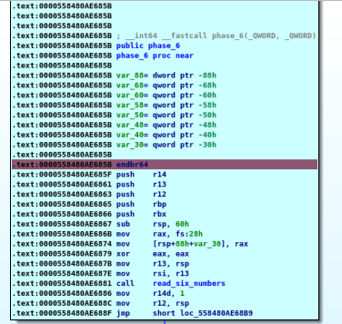

Ha Ha **"read_six_numbers"** from **Phase 2** again
now we know our input is six integers

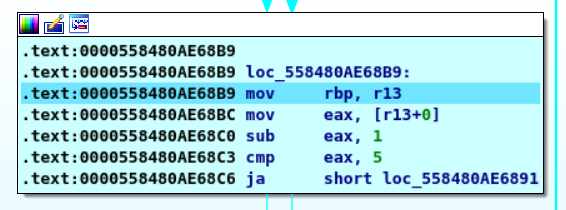

Then this loop checks if there a number greater than 6
so now we now that our password is 6 integers and all of them is less than 6
the next piece of information is going to be taken from the next loop and it's that there is no repeated number so our password is **"" 1 2 3 4 5 6"**
but wiat the last step is the order

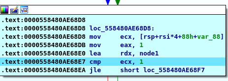

Here we find structure called **"node1"**
on investigating into it we find 

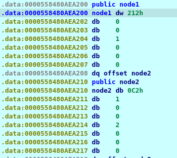
there are three numbers but we are interested in 2 only
the first is **212** and it's the value of the node and second is **1** and it's the label so by checking the others  we can make this table
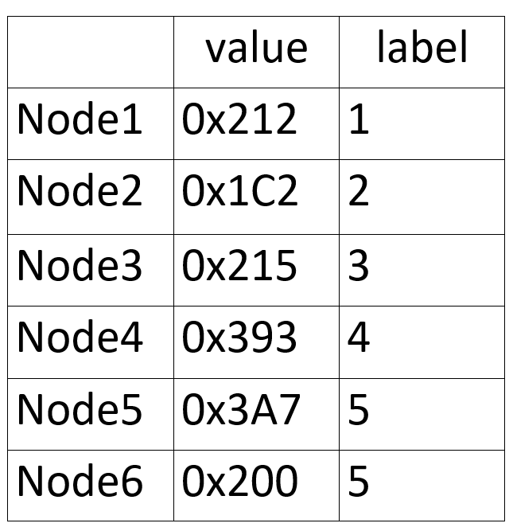
by reordering those numbers descendingly
we find our pass is (**5 4 3 1 6 2**)

so we are done here but my little surprise is there is one more **secret_phase**

### Tools used :

- **IDAFREE-7.7**

#### Written by

# *Karim Gomaa*
